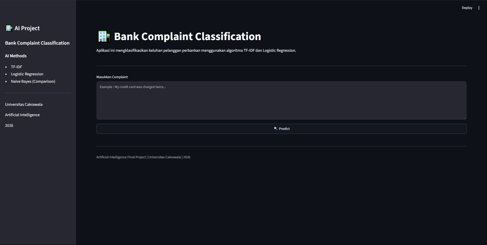
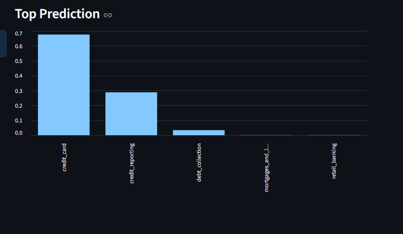

# 🏦 Bank Complaint Classification


# 🏦 Bank Complaint Classification

Final Project Artificial Intelligence

Universitas Cakrawala

---

## 📌 Deskripsi

Project ini merupakan aplikasi Machine Learning yang digunakan untuk mengklasifikasikan keluhan pelanggan bank berdasarkan isi complaint.

Model dibangun menggunakan algoritma **Logistic Regression** dan dibandingkan dengan **Naive Bayes**. Seluruh teks diproses menggunakan **TF-IDF Vectorizer**.

Aplikasi kemudian diimplementasikan menggunakan **Streamlit** sehingga dapat digunakan secara interaktif.

---

## Dataset

Dataset berasal dari Kaggle.

Jumlah Data

162.421 Complaint

Kolom yang digunakan

- narrative
- product

---

## Algoritma

Preprocessing

- Lowercase
- Remove URL
- Remove Number
- Remove Punctuation
- Remove Extra Space

Feature Extraction

- TF-IDF

Classification

- Logistic Regression
- Multinomial Naive Bayes

---

## Struktur Project

```
UAS_AI/

│
├── app.py
├── requirements.txt
├── README.md
│
├── data/
│ └── complaint.csv
│
├── model/
│ ├── model.pkl
│ ├── vectorizer.pkl
│ └── confusion_matrix.png
│
├── src/
│ ├── train.py
│ └── predict.py
│
├── images
│    ├── home.png
│    ├── predict.png
│    └── chat.png
│
└── notebooks/
└── BankComplaint.ipynb
```

---

## Install

Clone Repository

```bash
git clone https://github.com/username/bank-complaint-classification.git
```

Masuk Folder

```bash
cd bank-complaint-classification
```

Install Dependency

```bash
pip install -r requirements.txt
```

---

## Training Model

```bash
python src/train.py
```

Output

```
model.pkl

vectorizer.pkl
```

---

## Testing Model

```bash
python src/predict.py
```

---

## Menjalankan Streamlit

```bash
streamlit run app.py
```

---

## Hasil

Model terbaik

Logistic Regression

Accuracy

(Sesuaikan dengan hasil training Anda)

---

## Library

- pandas
- numpy
- scikit-learn
- streamlit
- matplotlib

---

## Author

Nama : Geoffta Handiyan AKwila

NIM : 24110300057

Universitas Cakrawala

2026

## Home



---

## Prediction


---

## Chart

